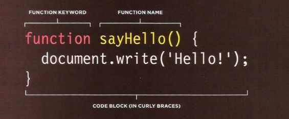

# basic Java script instructions

* A script is made up of a series of statements. Each
statement is like a step in a recipe
* Scripts contain very precise instructions. For example,
you might specify that a value must be remembered
before creating a calculation using that value
* Variables are used to temporarily store pieces of information used in the script
* Arrays are special types of variables that store more than one piece of related information. 

* JavaScript distinguishes between numbers (0-9),
strings (text), and Boolean values (true or false). 

## Declaring a function in javascript

