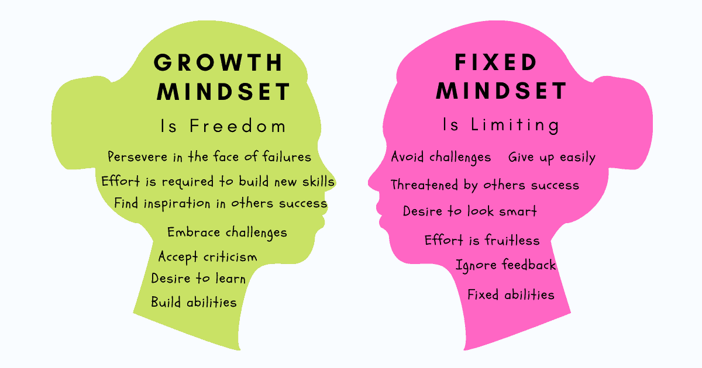

## growth mind set ##

of our beliefs, both conscious and unconscious, and how changing even the simplest of them can have profound impact on nearly every aspect of our lives.

One of the most basic beliefs we carry about ourselves, Dweck found in her research, has to do with how we view and inhabit what we consider to be our personality. A “fixed mindset” assumes that our character, intelligence, and creative ability are static givens which we can’t change in any meaningful way, and success is the affirmation of that inherent intelligence, an assessment of how those givens measure up against an equally fixed standard; striving for success and avoiding failure at all costs become a way of maintaining the sense of being smart or skilled. A “growth mindset,” on the other hand, thrives on challenge and sees failure not as evidence of unintelligence but as a heartening springboard for growth and for stretching our existing abilities. Out of these two mindsets, which we manifest from a very early age, springs a great deal of our behavior, our relationship with success and failure in both professional and personal contexts, and ultimately our capacity for happiness.

***5 Ways to Develop a Growth Mindset***

1. Acknowledge and embrace imperfections. ...
1. View challenges as opportunities. ...
1. Try different learning tactics. ...
1. Follow the research on brain plasticity. ...
1. Replace the word “failing” with the word “learning.” ...

THIS is MY git hub accont [MAYSAA](https://github.com/maysaahourani)